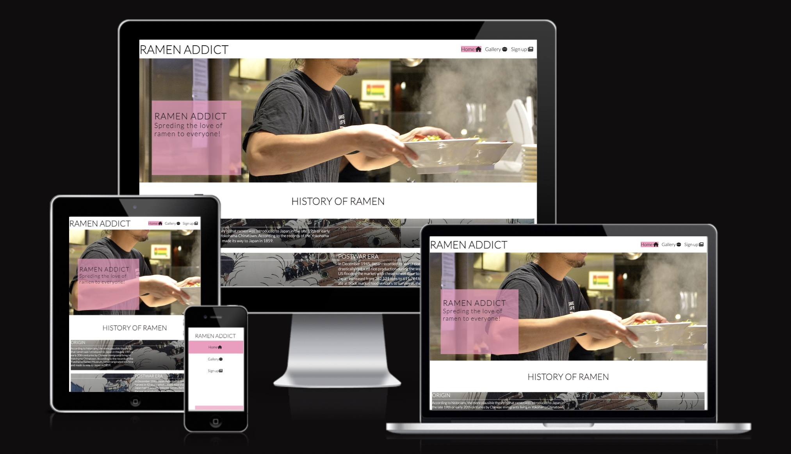
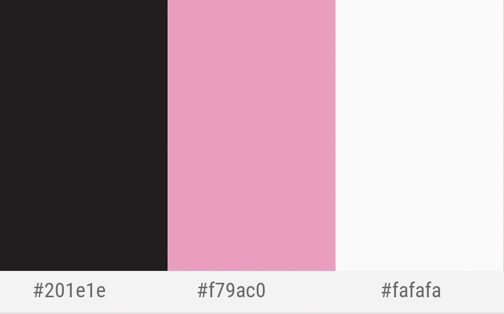

# Ramen addict

Ramen addict is a made-up blogger who wants to create a community for ramen lovers. This is a page that will bring the history of ramen and connect the blogger's audience to the community and social media accounts.

Visit the deployed website [here](https://cbergane.github.io/ramenaddic/index.html/).

## Table of Contents

1. [User Experience UX](#user-experience)
    1. [Project goals](#project-goal)
    2. [Audience story](#Audience-story)
    3. [Color scheme](#color-scheme)
    4. [Typography](#typography)
    5. [Wireframes](#wireframes)

***

## User Experience UX

### Project goals

* This website is acting like a hub for the user to educate about ramen history and direct its audience to the community.
* To give a sample of some of its content on social media.
* To provide a way for the audience to sign up for more content of their choice.

### User Story

* As an audience, it should be easy to navigate through the site and get a grip of what it is about.
* As an audience, you should easily find the user's social media profiles.
* As an audience, you should find sample content on social media easily.

### Color Scheme

                        
These colors are used to make a simple but clear color scheme, in Japanese, the simpler the better. I chose pink cherry blossom pink #ffb7c5 since it represents cherry blossom. And a charcoal black #212121 for a base color for most text and color of gray #fafafa, gray98 for areas where charcoal black is hard to read, such as overlapping images.

### Typography

The main font is Karla with a fallback font of Sans-Serif in case Karla is not being imported correctly. Lato is being used for all headers with a fallback of Sans-Serif in case Lato isn't being imported correctly. These two are appropriate parings for each other.