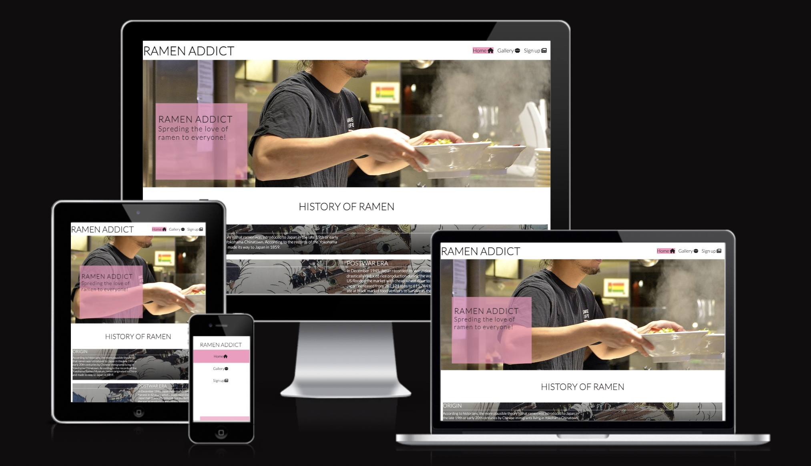

# Ramen addict

Ramen addict is a made up blogger who wants to create a community for ramen lovers. This is a page that will bring the history of ramen and connect the blogger's audience to the community and social media accounts.

Visit the deployed website [here](https://cbergane.github.io/ramenaddic/index.html/).

## Table of Contents ##

1. [User Experience UX](#user-experience)
    1. [Project goals](#project-goal)
    2. [User story](#user-story)
    3. [Color scheme](#color-scheme)
    4. [Typography](#typography)
    5. [Wireframes](#wireframes)
