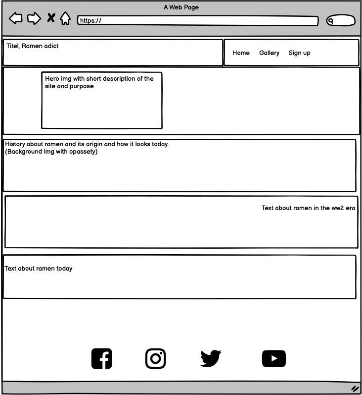

# Ramen addict

Ramen addict is a made-up blogger who wants to create a community for ramen lovers. This is a page that will bring the history of ramen and connect the blogger's audience to the community and social media accounts.

Visit the deployed website [here](https://cbergane.github.io/ramenaddic/).

## Table of Contents

1. [User Experience UX](#user-experience-ux)
    1. [Project goals](#project-goal)
    2. [Audience story](#Audience-story)
    3. [Color scheme](#color-scheme)
    4. [Typography](#typography)
    5. [Wireframes](#wireframes)
2. [Featured Design](#featured-design)
    1. [General](#general)
    2. [Landing Page](#landing-page)
    3. [Gallery Page](#gallery-page)
    4. [Sign Up Page](#sign-up-page)
3. [Technologies Used](#technologies-used)
    1. [Languages Used](#languages-used)
    2. [Frameworks, Libraries and Programs Used](#frameworks-libraries-and-programs-used)
4. 
***

## User Experience UX

### Project goals

* This website is acting like a hub for the user to educate about ramen history and direct its audience to the community.
* To give a sample of some of its content on social media.
* To provide a way for the audience to sign up for more content of their choice.

### User Story

* As an audience, it should be easy to navigate through the site and get a grip of what it is about.
* As an audience, you should easily find the user's social media profiles.
* As an audience, you should find sample content on social media easily.

### Color Scheme

                        
These colors are used to make a simple but clear color scheme, in Japanese, the simpler the better. I chose pink cherry blossom pink #ffb7c5 since it represents cherry blossom. And a charcoal black #212121 for a base color for most text and color of gray #fafafa, gray98 for areas where charcoal black is hard to read, such as overlapping images.

### Typography

The main font is Karla with a fallback font of Sans-Serif in case Karla is not being imported correctly. Lato is being used for all headers with a fallback of Sans-Serif in case Lato isn't being imported correctly. These two are appropriate parings for each other.

### Wireframes

[Balsamiq](https://balsamiq.com) was used to build the wireframes to showcase the elements of the site.

Page | Desktop version | Mobile version |
--- | --- | --- | ---|
Index |  | 
Gallery |  | 
Sign up |  | 
Tablet | 

[Back to top ⇧](#Ramen-addict)

## Featured Design

### General
* Responsive design across all platforms and devices.
* The colors are the same across the site.
* **Header**

    - The header image contains the page title and a nav bar and is responsive to the top of the page.
    - The title contains a link back to index.html.
    - The nav bar is identical across the site and responsive to smaller screens. It contains hover effects to make it easier to navigate to the desired content. And it contains fontawesome icons for the content of choice.

* **Footer**

    - The footer contains social media links and a hover effect for the fontawesome icons to highlight the audience's choice.

### Landing Page

* **Hero image**

    - The hero image contains a background image and a message about the purpose of the page.

* **Main Page**

    - The main page contains the history of ramen and its origin and a fixed background that is fixed across the three sections of history.

### Gallery Page

* **Gallery**

    - The gallery page contains a sample of the social media content that the audience can expect. The images contain hover effects and a short text to describe the image.

### Sign Up Page

* **Sign up page**

    -The sign-up page contains a fixed background image and a form with inputs of first, last name and a email input. They are required so you can't leave them empty. Radio buttons for the subscriber's choice of content and a submit button.

## Technologies Used

### Languages Used
* [HTML5](https://en.wikipedia.org/wiki/HTML5)
* [CSS3](https://en.wikipedia.org/wiki/CSS)

### Frameworks Libraries And Programs Used

* [Google Fonts](https://fonts.google.com/)
    - Google Fonts was used to import the fonts Lato and Karla into the style.css stylesheet. These fonts are used throughout the site.

* [Font Awesome](https://fontawesome.com/)
    - Font Awesome was used throughout all pages to add icons to create a better visual experience for UX purposes.

* [VS Studio Code](https://code.visualstudio.com)
    - Vs Studio Code was used to write the code and to commit and push content to github.

* [GitHub](https://github.com/)
     - GitHub was used to store the project after pushing.

* [Balsamiq](https://balsamiq.com/)
     - Balsamiq was used to create the wireframes during the design phase of the project.

* [Am I Responsive?](http://ami.responsivedesign.is/#)
    - Am I Responsive was used to see responsive design throughout the process and to generate a mockup image.

* [Chrome DevTools](https://developer.chrome.com/docs/devtools/)
    - Chrome DevTools was used during the development process for code review and to test responsiveness.

* [W3C Markup Validator](https://validator.w3.org/)
    - W3C Markup Validator was used to validate the HTML code.

* [W3C CSS Validator](https://jigsaw.w3.org/css-validator/)
    - W3C CSS Validator was used to validate the CSS code.

[Back to top ⇧](#ramen-addict)

